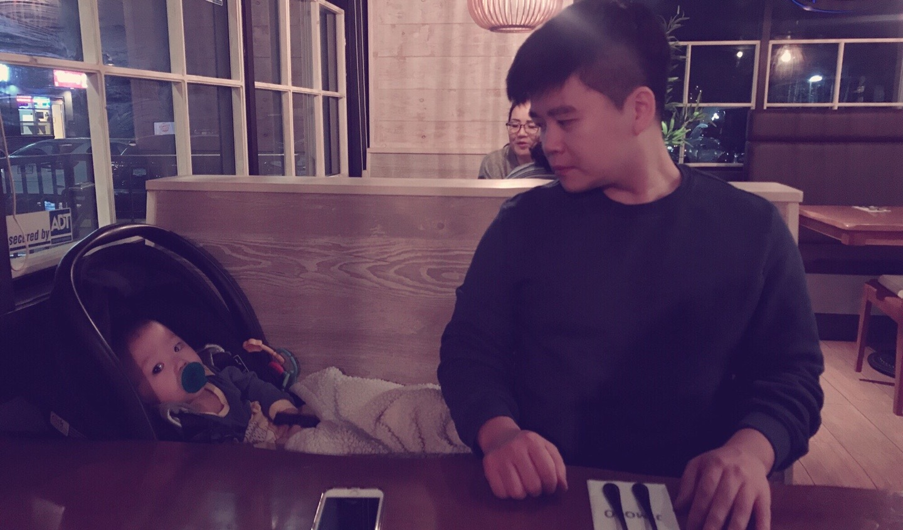

# 2019년 회고 
## ERP 개발을 해보다.
- 회사에서 ODOO 라는 framework 를 사용하여 처음으로 ERP 개발을 하고있다. 워크플로우와 데이터베이스와의 싸움이 치열했고 지금도 진행중이다.

## React 와 GraphQL 등 Web 관련 프로젝트
- Web 개발 프로젝트도 틈틈히 진행하고 있다. 내가 꿈꾸고 있는 것들을 하기 위해 매년 차곡차곡 내공을 다지는 중..

## 아이가 태어나다.
- 나의 아들이 2019년 4월 17일에 태어났다. Kang Joseph, 한국이름도 강요셉이다. 한국과 캐나다 이중국적으로 
아빠보다 더욱 큰세상에서 자유롭게 활동할 수 있게 언어적으로나 신분적으로 만들어 주고싶었다. 세상을 살아감에 있어 목표와 의미가 모두 아이가 태어남과 동시에 완전히 바뀌었고 더욱 긍정적이고 큰꿈을 꾸게 만들었다.

## 캐나다 목수로도 활동해보다.
- 캐나다에서 외장목수로서 일도 해보았다. 어릴적부터 기타를 좋아했던 나는 나무를 다루는  목수란 직업이 내인생에 한번쯤 도전해보고 싶었던 일이었다. 목수로 일하면서 Roy라는 캐나다 할아버지가 많이 알려주셔서 앞으로 여기서 내집을 수리하거나 꾸미는데에 필요한 좋은 기술들을 배울 수 있었고 수입도 괜찮았다.  하지만 체력적인 부분은 확실히 많이 필요한 직업이다. 프로그래밍과 건축은 상당히 닮은 부분이 많다.

## 아쉬웠던 점
### 1. 영어공부
- 회사에서 쓰는 영어말고 항상 내가 따로 공부하는 시간을 더 투자해야 제자리 걸음을 벗어날 수 있지만.. 올해는 출산과 육아등으로 바쁘다는 핑계로 많이 못했던 것 같다.(실제로 바뻣다.... 라고 하고싶...)
### 2. 없다(?)
- 2019년 인생에서 최고로 치열했다. 출산과 육아는 내가 생각했던 것보다 훨씬 치열하고 아름답고 행복한 일이었다.
사실 2019년을 되돌아보며 아쉬운점을 적어보고자 고민해보니.. 내인생에서 2019년보다 치열했던 해는 없었다.
누가 뭐라하던 나 스스로에게 처음으로 토닥토닥 칭찬해주고 싶다. 힘든 언덕 잘넘어왔다고..
그리고 너무 고생한 아내와 이세상에 태어나준 아들에게 너무 감사하다.

----
# 2020년 다짐

## 영어공부
- 목표는 "내 비즈니스를 만들고 운영하는데 불편함이 없는 수준을 3년내로 만든다."
- 매일매일 20~30분 투자면 충분하다고 생각한다. 꾸준함보다 강력한 것은 없다. 사실 육아로 인해 그이상 하고싶어도 못한다.

## 운동
- 아기가 생기기전처럼 가고싶을때 Gym을 가거나 잠을 충분히 자는 생활이 부족한 것은 사실
- 하지만 계란, 고구마, 두유, 두부 등 맛이 꽤있지만 다이어트에 좋은 재료들의 비율을 늘리고 아이안고 20~30분 들고 돌리고(?) 등등을 하면 Gym에서 하던 왠만한 웨이트의 효과를 누릴 수 있다.
- 올해 여름에는 와이프와 나 둘다 20대 전성기때로 한번 돌아가보자는 목표를 가지고 있다.

## 사이드 프로젝트와 알고리즘 공부
- 링크드인에서 가끔 좋은 회사들이 인터뷰제의를 하는 경우가 있다.
- 인터뷰제의한다고 붙여준다는건 당연히 아니겠지만(ㅋㅋ) 그래도 틈틈히 알고리즘 공부와 인터뷰연습을 하고
인생에서 북미의 공룡기업들에서도 한번쯤 일해보는건 신나는 일이라 생각된다. 많이 배울수 잇는 동료들도 만날 수 있을테고..
- 영어공부나 운동과 마찬가지로 사실 꾸준히가 젤 중요하다 생각된다. 결국은 습관이 사람을 만드는 것.
---- 

## 이번 결혼기념일에 아내가 찍어준 아들과 나
### 우리가족에게 더욱 좋은 것들을 해주고픈 가장이기에.. 작년보다 더 나은 내가 되고자한다.

